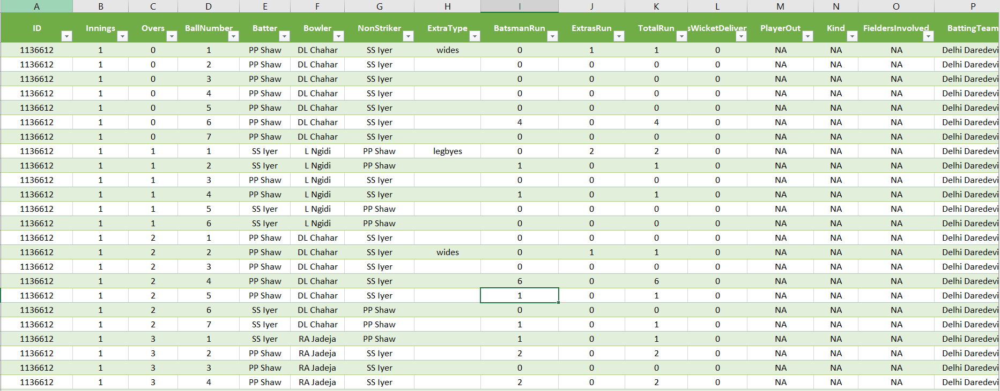

# IPL Dataset

This repository contains a dataset of IPL (Indian Premier League) matches, including ball-by-ball data in CSV format and match data in JSON format.

## Contents

- **json/**: This directory contains JSON files for each IPL match. Each JSON file contains match details such as teams, players, innings, and outcomes.

- **csv/**: This directory contains ball-by-ball data in CSV format for each IPL match. Each CSV file provides detailed information about each ball bowled in the match, including batting team, bowling team, batsman, bowler, runs scored, extras, and more.

## How to Use

- You can use the JSON files in the `json/` directory to analyze overall match data, such as team performance, player statistics, and match outcomes.

- The CSV files in the `csv/` directory provide detailed ball-by-ball data, Platers_details, teams_details and match details allowing for granular analysis of individual deliveries, player performances, and match dynamics.

## Automated Generation

- The ball-by-ball CSV datasets are automatically generated using a workflow. Whenever new match JSON files are added to the repository, the workflow processes them and generates the corresponding CSV files.

- **Update Frequency**: The dataset is updated daily with data from matches played two days prior.

## Contributing
Contributions to this dataset are welcome! If you have additional IPL match data to contribute or suggestions for improvements, feel free to submit a pull request.

## License
This dataset is provided under the `MIT License`.